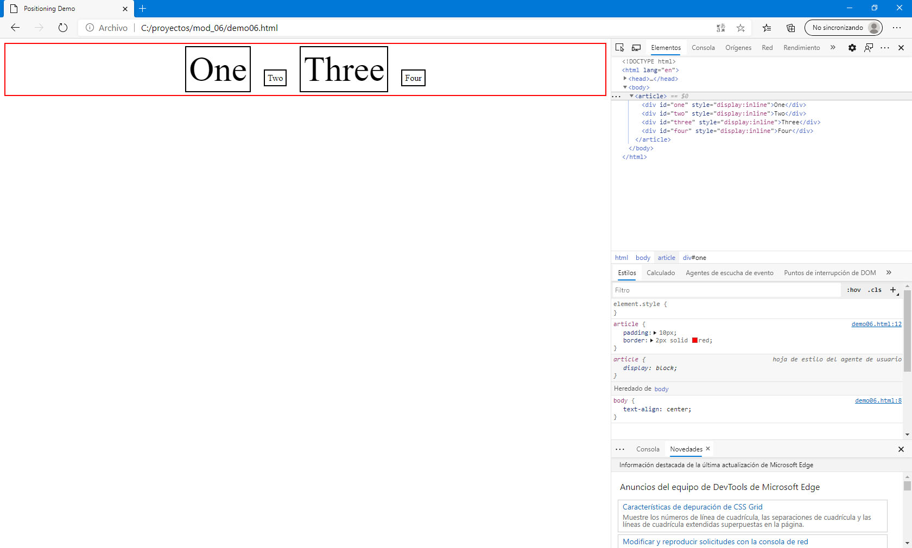
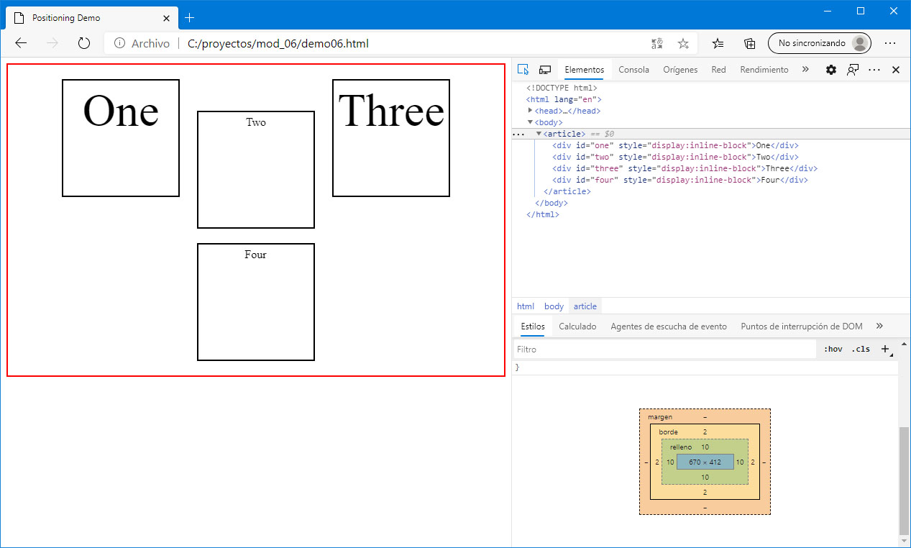
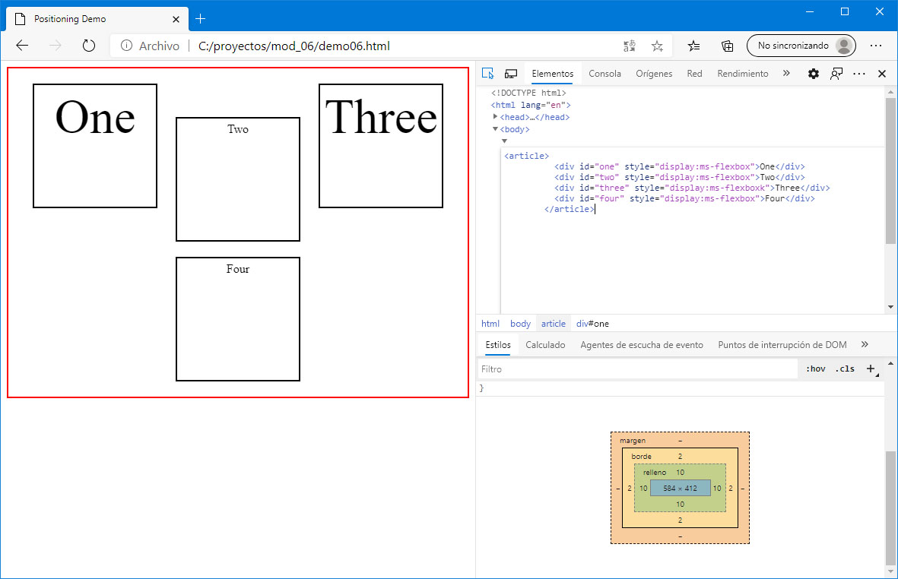
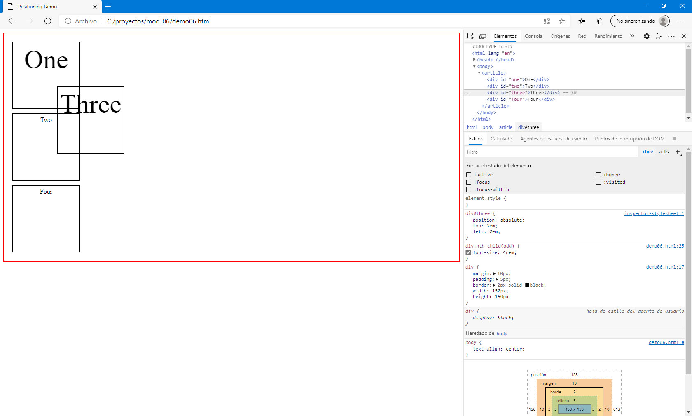

### Module 6: Styling HTML5 by Using CSS3
#### Lesson 2: Styling Block Elements
##### Demonstration: Switching Between Cascading Style Sheets (CSS) Layout Models


crear archivo demo.html

``` html
 <!DOCTYPE html>
  <html xmlns="http://www.w3.org/1999/xhtml">
  <head>
    <title>Positioning Demo</title>
    <style type="text/css">
      body {
        text-align: center;
      }

      article {
        padding: 10px;
        border: 2px solid red;
      }

      div {
        margin: 10px;
        padding: 5px;
        border: 2px solid black;
        width: 150px;
        height : 150px;
      }

      div:nth-child(odd) {
        font-size: 4rem;
      }
    </style>
  </head>
  <body>
    <article>
      <div id="one">One</div>
      <div id="two">Two</div>
      <div id="three">Three</div>
      <div id="four">Four</div>
    </article>
  </body>
  </html>
  ``` 


Desde las herramientas de desarrollador
modificar el estilo añadiendo el atributo display: inline para cada elemento div



modificar el estilo por display: inline-block



modificar el estilo por display: ms-flex



añadir la nueva regla #three 



