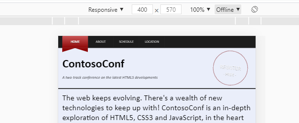
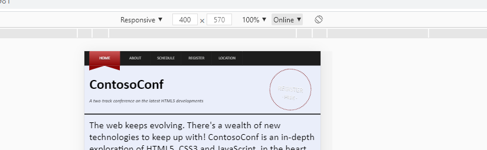
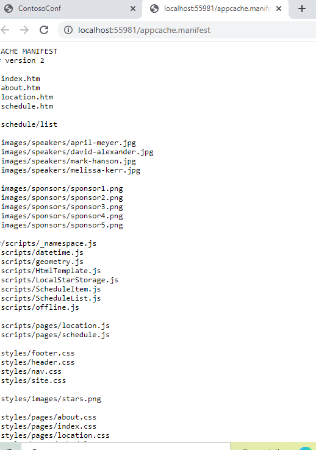
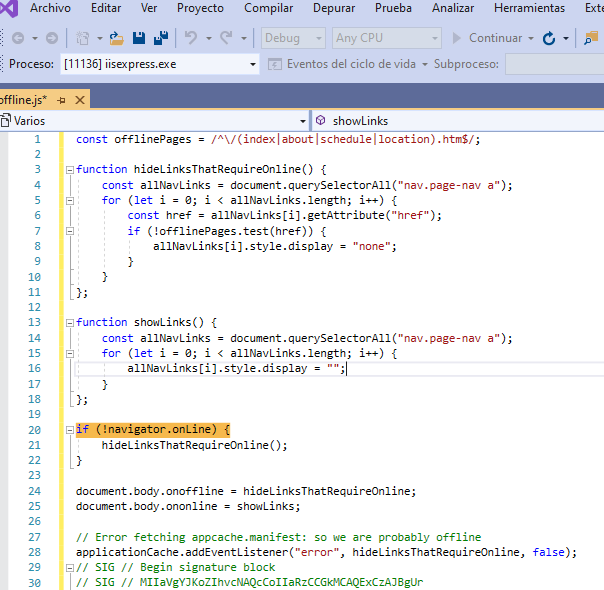
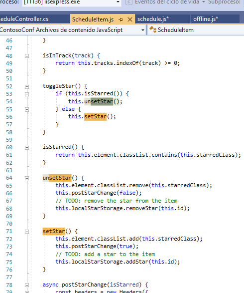

# Module 9: Adding Offline Support to Web Applications

Wherever a path to a file starts with *[Repository Root]*, replace it with the absolute path to the folder in which the 20480 repository resides. For example, if you cloned or extracted the 20480 repository to **C:\Users\John Doe\Downloads\20480**, change the path: **[Repository Root]\AllFiles\20480C\Mod01** to **C:\Users\John Doe\Downloads\20480\AllFiles\20480C\Mod01**.

# Lesson 2: Adding Offline Support by Using the Application Cache

### Demonstration: Adding Offline Support to Web Applications

#### Preparation Steps 


#### Demonstration  

observar las diferencias offline y oline
    
 
  

	 
5.	In **Solution Explorer**, expand the **ContosoConf** project, and then double-click **appcache.manifest**.
   


   
   
7.	In **Solution Explorer**, expand the **scripts** folder, and then double-click **offline.js**.
8.	In the **Code Editor** window, find the following code:
   ```javascript
        if (!navigator.onLine) {
            hideLinksThatRequireOnline();
        }
   ```
      

   
9.	Explain that this statement detects whether the browser has a network connection. If it does not have a network connection, the **hideLinksThatRequireOnline()** function modifies the links in the navigation bar to ensure that the pages that require network connectivity (such as the **Location** and **Register** pages) do not appear.


10.	In **Solution Explorer**, expand the **scripts** folder, and then double-click **ScheduleItem.js**.
11.	In the **Code Editor** window, find the **setStar()** function. Point out that this function saves information about sessions that the user has selected (by clicking the star icon) to local storage, and also posts this information to the web server. Similarly, the **unsetStar()** function removes information about selected sessions from local storage. In this way, the user can still record which sessions they are interested in, even if the browser does not have a network connection.

      

