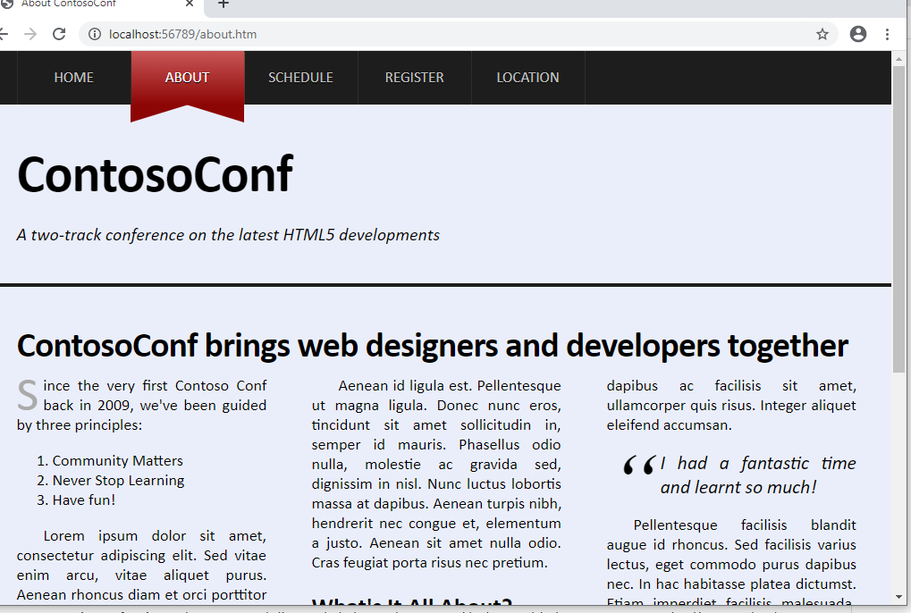
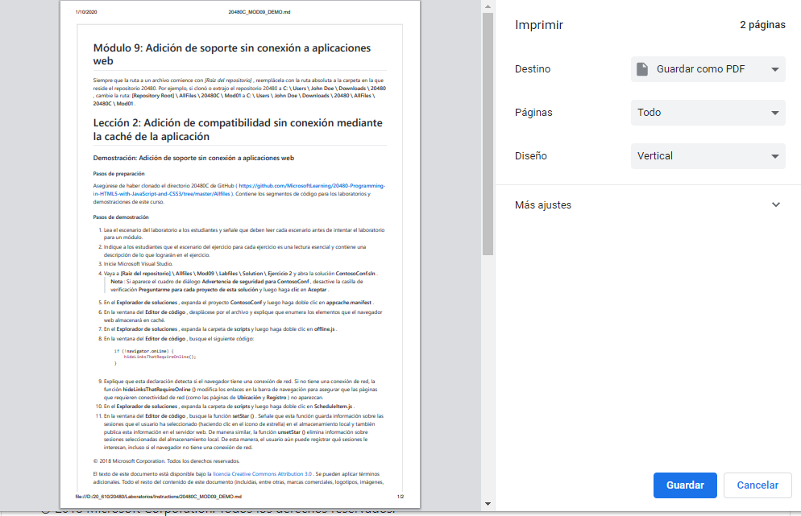
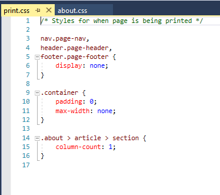
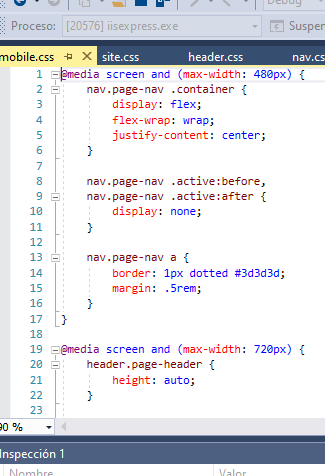

# Module 10: Implementing an Adaptive User Interface

# Lesson 2: Creating an Adaptive User Interface

### Demonstration: Implementing an Adaptive User Interface

 
 

 
 
ojo max-width:500px
 

