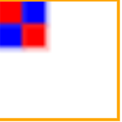
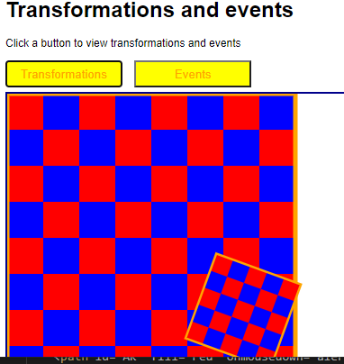
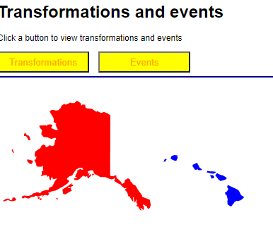
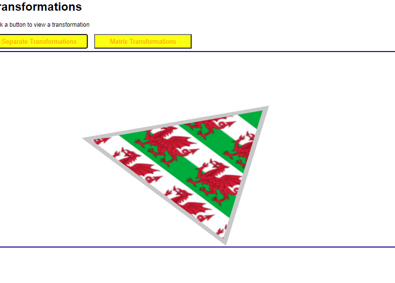
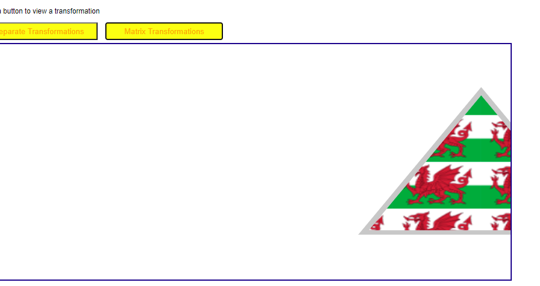

El ejemplo dibuja un tablero de ajedrez a partir de un patern
define cuatro cuadrados de 40x40 en una regilla de 80X80 
com le añade   atternUnits="userSpaceOnUse" quiere decir que 
en cualquier figura que se aplique el patron se rellene con dicho patron
basta hacerlo en un rectando de 320x320 para que fuese un tablero de ajedrez real.

 

La transformacion tambien es sencilla 

dibuja un rectangulo con ese pattern y lo mete en un g y lo rota rotate(angle, cx, cy): 20grados con un punto en 160,160
ese mismo g lo transforma en transform="scale(0.5)" y por ultimo  transform="translate(200, 200)

 

```html
<!-- Demonstrate transformations -->
	<svg xmlns="http://www.w3.org/2000/svg" id="transformations" >
		<defs>
			<pattern id="checkerPattern" width="80" height="80"  patternUnits="userSpaceOnUse"> 
				<rect fill="red"  x="0"  y="0"  width="40" height="40" />
				<rect fill="blue" x="40" y="0"  width="40" height="40" />
				<rect fill="blue" x="0"  y="40" width="40" height="40" />
				<rect fill="red"  x="40" y="40" width="40" height="40" />
			</pattern>
		</defs>

		<rect x="0" y="0" width="400" height="400" fill="url(#checkerPattern)"  stroke="orange" stroke-width="5" />

		<!-- You can set the transform property to "translate", "scale", "rotate", "skewX", or "skewY" -->
		<g transform="translate(200, 200)">
			<g transform="scale(0.5)">
				<g transform="rotate(20, 160, 160)">
					<rect x="0" y="0" width="200" height="200" fill="url(#checkerPattern)" stroke="orange" stroke-width="5" />
				</g>
			</g>
		</g>
    </svg>
```

la segunda desmostracion son dos mapas
los han dibujado en un path d = m x y ....... z haciendo los dibujos de hawwai y Alaska
los han agrupado y transform="translate(0,-400)" onmousedown="alert('I am Hawaii');"  fill="blue"

 

para ver que se puede acceder a el a traves de css y manejar eventos ya que es un objeto más del DOM

```css
y en el path:hover
        path:hover {
			fill: yellow;
			stroke: green;
			stroke-width: 2pt;  
			stroke-dasharray: 5 2;  lo linea de puntos el primero de 5 y el segundo de 2 y así sucesivamente
		}
```
````html
	<!-- Demonstrate events -->
	<svg xmlns="http://www.w3.org/2000/svg" id="events">
		<g transform="translate(0,-400)">
			<path id="HI" fill="blue" onmousedown="alert('I am Hawaii');"  
				d="m 233.08751,519.30948 1.93993,-3.55655 2.26326,-0.32332 ....................-0.32332,-2.1016 z" />
			<path id="AK" fill="red" onmousedown="alert('I am Alaska');"   
				d="m 158.07671,453.67502 -0.32332,85.35713 1.6166,0.96996 3.07157,....... 0.32332,2.26326 z" />
		</g>
	</svg>
```  


 ### dibujar con canvas

la transformacion implica modificar el contexto y volver a pintar

```html
 <body>
	
  <h1>Transformations</h1>
  
  <p>Click a button to view a transformation</p>
  
  <button onclick="demoSeparateTransformations()">Separate Transformations</button>
  <button onclick="demoMatrixTransformations()">Matrix Transformations</button>
  <br/>
  
  <canvas id="myCanvas" width="900px" height="400px">
    Sorry, your browser does not support canvas.
  </canvas>

  
  
  <script>
  
    // Get the canvas element and its drawing context.
    var canvas = document.getElementById('myCanvas');
    var context = canvas.getContext('2d');
    context.lineWidth = 5;

	
    function demoSeparateTransformations() {
    
      // Clear any existing content in the canvas, and save the current context settings.
      context.clearRect(0, 0, canvas.width, canvas.height);
      context.save();

      // Translate the coordindate system, using translate(deltaX, deltaY).      
      context.translate(canvas.width/2, canvas.height/2);

      // Scale the coordindate system, using scale(scaleX, scaleY).      
      context.scale(2, 1.5);
      
      // Rotate the coordinate system, using rotate(clockwiseAngleInRadians).
      context.rotate(Math.PI/4);
      
      // Draw the shape.
      drawShape();
      
      // Restore the original context settings.
      context.restore();
    }

	
    function demoMatrixTransformations() {
    
      // Clear any existing content in the canvas, and save the current context settings.
      context.clearRect(0, 0, canvas.width, canvas.height);
      context.save();

      // First do a simple transformation.
      context.translate(400, 0);

      // Perform a relative transformation, using transform(scaleX, skewX, skewY, scaleY, translateX, translateY).
      context.transform(2, 0, 0, 1.5, canvas.width/2, canvas.height/2);

      // Perform an absolute transformation, using setTransform(scaleX, skewX, skewY, scaleY, translateX, translateY).
      // context.setTransform(2, 0, 0, 1.5, canvas.width/2, canvas.height/2);
      
      // Draw the shape.
      drawShape();
      
      // Restore the original context settings.
      context.restore();
    }

	
    function drawShape() {
	
      // Create a pattern to use as a style for filling and stroking.
      var image = document.getElementById("wales");
      var theStyle = context.createPattern(image, "repeat");

      // Draw a filled triangle, using the specified style.
      context.fillStyle = theStyle;
      context.strokeStyle = "rgb(200, 200, 200)";
      context.beginPath();
      context.moveTo(0, -80);
      context.lineTo(100, 80);
      context.lineTo(-100, 80);
      context.closePath();
      context.fill();
      context.stroke();
    }

  </script>
 
</body>
</html>

```


 canvas2.PNG
 
 