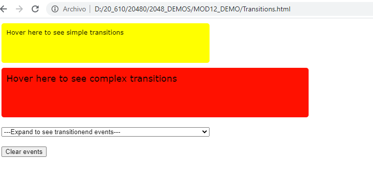
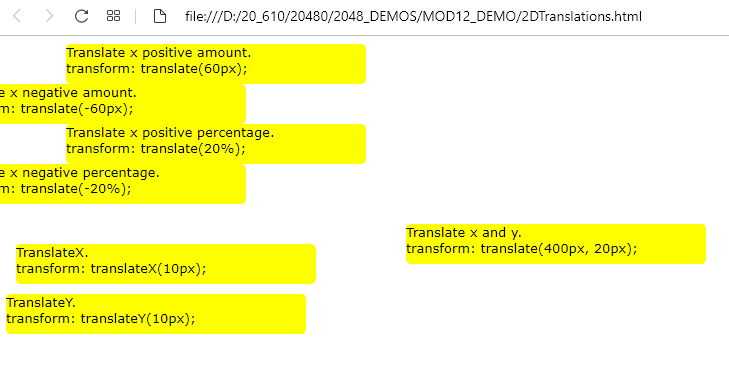
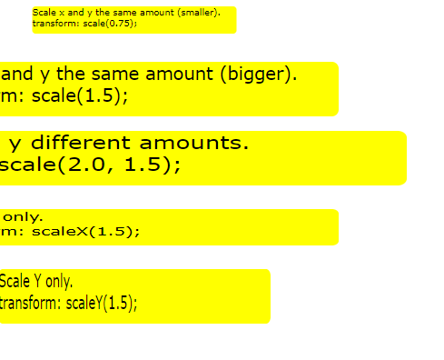
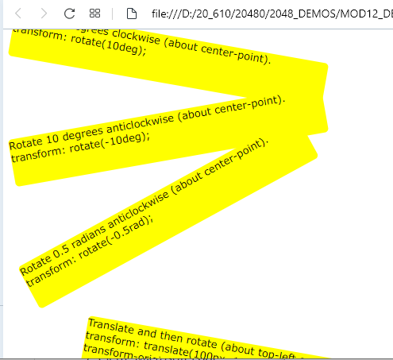
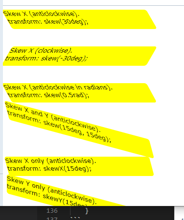
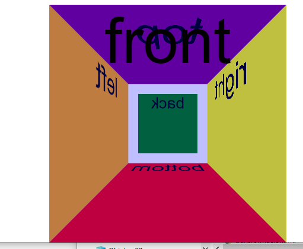

## demo 12 Animación de la interfaz de usuario 

apuntes https://github.com/juanradev/2048_DEMOS/tree/master/MOD12_DEMO/apuntes.md


Transitions.html

 

```html
        div {
            font-family: verdana, arial; 
            font-size: small;
            width: 400px;
            height: 60px;
            padding: 10px 10px;
            margin: 10px;
            background-color: yellow;
            border-radius: 5px;
        }

        div.simple {
            transition: width 2s, height 2s, font-size 2s, background-color 3750ms;
        }

        div.complex {
             transition-property: width, height, font-size, background-color;
            transition-duration: 2s, 2s, 2s, 3750ms;
            transition-timing-function: ease-in;
            transition-delay: 1s;
        }

        div:hover {
            width: 600px;
            height: 80px;
            font-size: large; 
            background-color: red
        }
```

````script
 function onLoad() {

            initMessagesList();

            var divElements = document.querySelectorAll("div");
            for (var i = 0; i < divElements.length; i++) {
                divElements[i].addEventListener("transitionend", onTransitionend, true);
            }
        }

        var messagesElement = document.querySelector("messages");

        function onTransitionend(e) {
            messages.add(new Option(e.propertyName + ", elapsedTime " + e.elapsedTime));
        }

        function initMessagesList() {
            messages.innerHTML = "";
            messages.add(new Option("---Expand to see transitionend events---"));
        }
```

```html
   <div class="simple">Hover here to see simple transitions</div>
    <div class="complex">Hover here to see complex transitions</div>
```


2dtransactions

 

```css
div {
    	font-family: verdana, arial; 
    	font-size: small;
    	width: 300px;
    	height: 40px;
    	background-color: yellow;
    	border-radius: 5px;
    }
    
    .translate1 {
    	transform: translate(60px);
    	-ms-transform: translate(60px);
    	-webkit-transform: translate(60px);
    	-moz-transform: translate(60px);
    	-o-transform: translate(60px);
    }
```

scale2d
 
```css


    div {
    	font-family: verdana, arial; 
    	font-size: small;
    	width: 300px;
    	height: 40px;
    	background-color: yellow;
    	border-radius: 5px;
        }
    
    .scale1 {
    	transform: scale(0.75);
    	-ms-transform: scale(0.75);
    	-webkit-transform: scale(0.75);
    	-moz-transform: scale(0.75);
    	-o-transform: scale(0.75);
    }
```

rotate

 

```css
 div {
    	font-family: verdana, arial; 
    	font-size: small;
    	width: 400px;
    	height: 60px;
    	background-color: yellow;
    	border-radius: 5px;
    }
    
    .rotate1 {
    	transform: rotate(10deg);
    	-ms-transform: rotate(10deg);
    	-webkit-transform: rotate(10deg);
    	-moz-transform: rotate(10deg);
    	-o-transform: rotate(10deg);
    }
```

sesgo 2D
 

```css

 div {
    	font-family: verdana, arial; 
    	font-size: small;
    	width: 300px;
    	height: 40px;
    	background-color: yellow;
    	border-radius: 5px;
    }
    
    .skew1 {
    	transform: skew(30deg);
    	-ms-transform: skew(30deg);
    	-webkit-transform: skew(30deg);
    	-moz-transform: skew(30deg);
    	-o-transform: skew(30deg);
    }
```
3DTransformations
 

```css
 #container {
        margin: 400px;
        perspective: 200px;
        -webkit-perspective: 200px;
        -moz-perspective: 200px;
        -o-perspective: 200px;

        transition: transform 5s;
    }

    #container:hover {
        transform: rotate(90deg);
    }

    #rightFace  {
        background-color: yellow;
        transform: translateX(-100px) rotateY(90deg) translateZ(200px);
        -webkit-transform: translateX(-100px) rotateY(90deg) translateZ(200px);
        -moz-transform: translateX(-100px) rotateY(90deg) translateZ(200px);
        -o-transform: translateX(-100px) rotateY(90deg) translateZ(200px);
    }


    #leftFace {
        background-color: orange;
        transform: translateX(100px) rotateY(-90deg) translateZ(200px);
        -webkit-transform: translateX(100px) rotateY(-90deg) translateZ(200px);
        -moz-transform: translateX(100px) rotateY(-90deg) translateZ(200px);
        -o-transform: translateX(100px) rotateY(-90deg) translateZ(200px);
    }


    #topFace {
        background-color:  purple;
        transform: translateY(100px) rotateX(-90deg) rotateY(180deg) translateZ(200px);
        -webkit-transform: translateY(100px) rotateX(-90deg) rotateY(180deg) translateZ(200px);
        -moz-transform: translateY(100px) rotateX(-90deg) rotateY(180deg) translateZ(200px);
        -o-transform: translateY(100px) rotateX(-90deg) rotateY(180deg) translateZ(200px);
    }


    #bottomFace {
        background-color: red;
        transform: translateY(-100px) rotateX(90deg) rotateY(180deg) translateZ(200px);
        -webkit-transform: translateY(-100px) rotateX(90deg) rotateY(180deg) translateZ(200px);
        -moz-transform: translateY(-100px) rotateX(90deg) rotateY(180deg) translateZ(200px);
        -o-transform: translateY(-100px) rotateX(90deg) rotateY(180deg) translateZ(200px);
    }


    #backFace {
        background-color: green;
        transform: rotateY(180deg) translateZ(100px);
        -webkit-transform: rotateY(180deg) translateZ(200px);
        -moz-transform: rotateY(180deg) translateZ(200px);
        -o-transform: rotateY(180deg) translateZ(200px);
    }


    #frontFace  {
        background-color: rgba(0, 0, 255, 0.25);
        transform: translateZ(100px);
        -webkit-transform: translateZ(100px);
        -moz-transform: translateZ(100px);    
        -o-transform: translateZ(100px);    
    }

    </style>

    <script>
        function onChangePerspective() {
            var container = document.getElementById("container");
            alert(container.style["msPerspective"]);
        }

    </script>

</head>

<body>
<div id="container">
    <div id="rightFace">right</div>
    <div id="leftFace">left</div>
    <div id="topFace">top</div>
    <div id="bottomFace">bottom</div> 
    <div id="backFace">back</div>
    <div id="frontFace">front</div> 
</div>
</body>
3DTransformations
 

```css