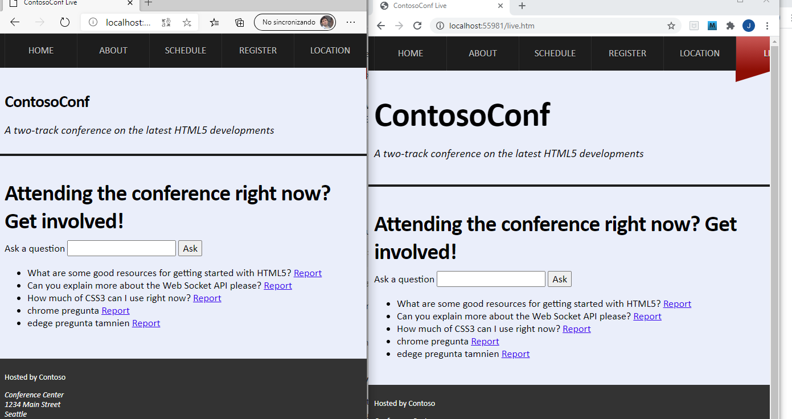

### demo 13 WEBSOCKETS

ejecutar la aplicion y
examinar el funcionamiento de la pagina live


 

Revision del código 

```javascript

export class LivePage {

    constructor(socket, sectionElement) {
        this.initializeSocket(socket);
        this.initializeUI(sectionElement);
    }

	/*
	initializeSocket . Este método organiza el manejo del evento onmessage del socket y llama al método handleSocketMessage () 
	cada vez que llega un mensaje. */
	
    initializeSocket(socket) {
        this.socket = socket;
        this.socket.onmessage = this.handleSocketMessage.bind(this);
    }

	
	/* askQuestion . Este método se ejecuta cuando el usuario ha escrito una pregunta y ha hecho clic en Preguntar . 
	El texto se formatea como un mensaje y se serializa como JSON antes de enviarse al servidor web para su procesamiento. */
	
	askQuestion(text) {
        const message = {ask: text};
        const json = JSON.stringify(message);
        this.socket.send(json);
        this.questionInput.value = "";
    }
	
	/* handleSocketMessage . Este método se ejecuta cuando el servidor web envía un mensaje al navegador. 
	El método examina el mensaje entrante y, si contiene preguntas, llama al método handleQuestionsMessage ()
	para mostrar las preguntas en la página web. Si el mensaje contiene una solicitud de eliminación, 
	el método llama al método handleRemoveMessage () para eliminar la pregunta de la página web
	*/
	
	handleSocketMessage(event) {
		// TODO: Parse the event data into message object.
		const message = JSON.parse(event.data);
		if (message.questions) {
			this.handleQuestionsMessage(message);
		} else if (message.remove) {
			this.handleRemoveMessage(message);
		}
	}
	
	/* handleQuestionsMessage . Este método analiza un mensaje y muestra las preguntas que contiene en la página web. */
	
	handleQuestionsMessage(message) {
		// message has the form:
		//   { questions: [
		//         { text: "...", id: 1 },
		//         { text: "...", id: 2 }
		//   ] }

		// TODO: Display each question in the page, using the displayQuestion function.
		message.questions.forEach(this.displayQuestion, this);
	}
	
	reportQuestion . Este método se ejecuta cuando el usuario hace clic en el enlace Report  ; 
	envía un mensaje de informe al servidor web que contiene la identificación de la pregunta que se eliminará.
	
	reportQuestion(questionId) {
        // TODO: Send socket message { report: questionId }
        this.socket.send(JSON.stringify({ report: questionId }));
    }
	
	
    initializeUI(sectionElement) {
        this.questionListElement = sectionElement.querySelector("ul");
        this.questionInput = sectionElement.querySelector("input");

        const form = sectionElement.querySelector("form");
        form.addEventListener("click", this.handleFormSubmit.bind(this), false);

        this.questionListElement.addEventListener("click", this.handleQuestionsClick.bind(this), false);
    }

    handleFormSubmit(event) {
        // Prevent the form actually submitting.
        event.preventDefault();

        const text = this.questionInput.value;
        if (text) {
            this.askQuestion(text);
        }
    }

    handleRemoveMessage(message) {
        const listItems = this.questionListElement.querySelectorAll("li");
        for (let i = 0; i < listItems.length; i++) {
            if (listItems[i].questionId === message.remove) {
                this.questionListElement.removeChild(listItems[i]);
                break;
            }
        }
    }

    displayQuestion(question) {
        const item = this.createQuestionItem(question);
        item.appendChild(this.createReportLink());
        this.questionListElement.appendChild(item);
    }

    createQuestionItem(question) {
        const item = document.createElement("li");
        item.textContent = question.text + " ";
        item.questionId = question.id;
        return item;
    }

    createReportLink() {
        const report = document.createElement("a");
        report.textContent = "Report";
        report.setAttribute("href", "#");
        report.setAttribute("class", "report");
        return report;
    }

    handleQuestionsClick(event) {
        event.preventDefault();

        const clickedElement = event.srcElement || event.target;
        if (this.isReportLink(clickedElement)) {
            const questionId = clickedElement.parentNode.questionId;
            this.reportQuestion(questionId);
            clickedElement.textContent = "Reported";
        }
    }

    isReportLink(element) {
        return element.classList && element.classList.contains("report");
    }


}
````
