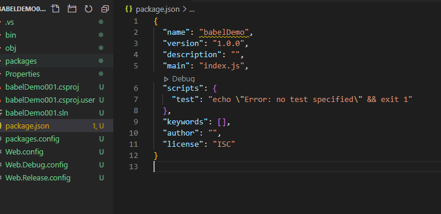

## Módulo 15: Empaquetado de JavaScript para implementación de producción

### Demostración: uso de la CLI de Babel para compilar código JavaScript

Despues de crear el proyecto nos disponemos a añadir un npm configuration file

Como no lo tenemos da lo mismo abrimos terminal y ejecutamos npm init -y 

Con ello nos crea el package.json

el nombre no le mola así que lo cambiaremos por   "name": "babeldemo-app",

Añadimos al proyecto el fichero src/index.js con codigo EM6

desde terminal ejecutamos 
04 npm install --save-dev babel-cli babel-preset-es2015.PNG

Modificamos el package.json

  "scripts": {
    "build": "babel --presets es2015 src -d dist"
  },

y ejecutamos en terminal npm run build (desde Code basta con pulsar en debug -dentro de la vista del fichero-, si no teclealo en terminal)

con ello nos crea en la carpeta dist lo que tengamos en la carpeta run 
es decir el index.js pero en EM5

por último añadimos la carpeta dist al proyecto

 

